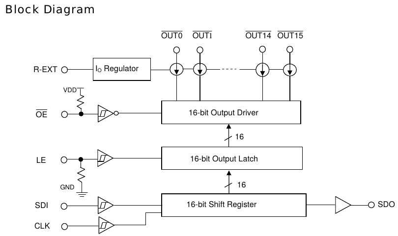
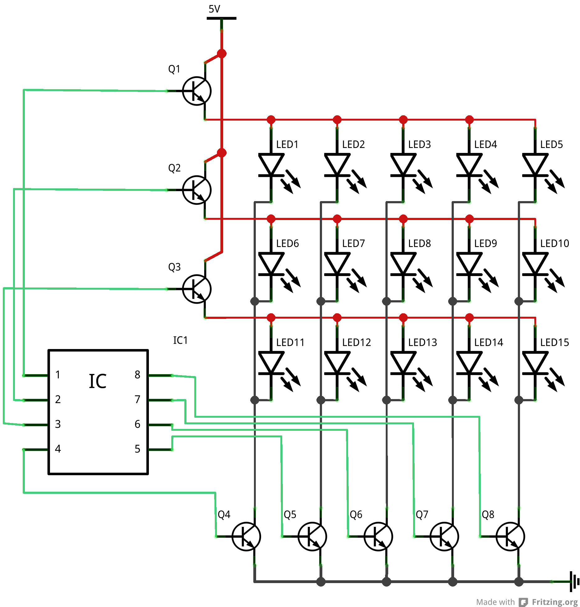

# Display #

Code in this folder supports different kind of displays.

## Led matrix code ##
I obtained a 32x32 RGB Led matrix display from [here](http://www.play-zone.ch/de/bauteile/led/segmente-matrix/rgb-led-panel-32x32.html).
they reference [this](https://learn.sparkfun.com/tutorials/rgb-panel-hookup-guide) page for the wire up of this display. This kind of panels is reversed engineered [here](http://www.rayslogic.com/propeller/Programming/AdafruitRGB/AdafruitRGB.htm).

Basically you have 6 x 32 bit shift register with the data input (`SDI`) connected to `R0`, `R1`, `G0`, `G1`, `B0` and `B1`. These shift registers are realized with a chip similar to [MPI5026](http:/www.rayslogic.com/propeller/Programming/AdafruitRGB/MBI5026.pdf). The data is shifted into the register with the rising edge of `clk`. This chip can directly drive the cathode of a led. The output of the shift register is connected to a output latch controlled by the `stb`, `strobe` or `latch` signal. If this input is set to `H` the shift register output is the output of the latch register. If you set the `latch` control signal to `L` the latch register output stays fixed at the input just before the latch signal edge. To drive the MBI5026 output there is further an output enable `oe` which drives the cathode of the LED with a constant current difined by the chips `R-EXT` input. By daisy chaining several such chips (connect SDO to SDI of the next chip) you can build larger displays.

  

The annode is connected over a 3:8 demultiplexer (eg [74HC138](http://www.mouser.com/ds/2/405/sn74hc138-445126.pdf)) to 'a', 'b' and `c`. If you own a 32x16 Led matrix. If you do have the 'd' connector you have a 4:16 demultiplexer and therfore a 32x32 display. As this chip can not drive the necessary current for 64 LEDs there are switching elements on the panel to do that.

To control the singel led you activate over the `a`, `b`, `c` and `d` input a group of line:

 `a` | `b` | `c` | `d` | Upper line select | Lower Line select |
-----|-----|-----|-----|-------------------|-------------------|
  0  |  0  |  0  |  0  |        0          |        16         |
  0  |  0  |  0  |  1  |        1          |        17         |
  0  |  0  |  1  |  0  |        2          |        18         |
  0  |  0  |  1  |  1  |        3          |        19         |
  0  |  1  |  0  |  0  |        4          |        20         |
  0  |  1  |  0  |  1  |        5          |        21         |
  0  |  1  |  1  |  0  |        6          |        22         |
  0  |  1  |  1  |  1  |        7          |        23         |
  1  |  0  |  0  |  0  |        8          |        24         |
  1  |  0  |  0  |  1  |        9          |        25         |
  1  |  0  |  1  |  0  |       10          |        26         |
  1  |  0  |  1  |  1  |       11          |        27         |
  1  |  1  |  0  |  0  |       12          |        38         |
  1  |  1  |  0  |  1  |       13          |        29         |
  1  |  1  |  1  |  0  |       14          |        30         |
  1  |  1  |  1  |  1  |       15          |        31         |

Each individual pixel on a line is given by the position of the bit shifted into the shift register. So the first bit is controlling led 31 on a line and the last bit shifted into the register is controlling led 0 - but your mileage may vary. Following image shows a simplyfied led matrix cabeling (Taken from [here](http://www.tacticalcode.de/2013/01/led-matrix-theoretische-planung.html):

  

To display a full image you quickly select two lines with the `a`, `b`, `c` and `d` line and select the active led in a line by setting the related bit in the shift register to active - which connects the cathod of the  led to ground. If you do this quick enough you see a steady image.

To controll the brightness of a LED you have to controll the duration during which the led is switched on. For this you can map the weight of a bit in the brighness information of a color to a duration for switching a led on. For a 4 bit value you shedule time slots with the duration 1ms, 2ms, 4ms and 8ms which sum up to 15ms and results in about 66 frames per second. For example you you would like to have the red component set to 13 (binary `b1101`) you shedule the LED to be on in the 1, 4 and 8 ms slot. 

To access the data to be shifted out at the beginning of each time slot efficiently, the panel RGB data is stored in a special way. First we separate the color bits with respect to the bits weight. For examle all least significant bit (lsb) for all colors are stored together and the RGB color bits for weight 2 are stored together. Further we have to interleave the bits from the upper part of the panel with the bits from the lower part of the panel. The inspiration for my module came from the [arduino](https://github.com/adafruit/RGB-matrix-Panel/blob/master/RGBmatrixPanel.cpp) implementation for this panel So we have to group the bits in the following way (where X[x][y][w] X: R=red, G=green, B=blue, x:xcoordinate of pixel (0..31), y: y-coordinate of pixel (0..31) and w= weight of pixel 1,2,4 or 8):

Address in memory |   Bit
                  | 7             | 6             | 5             | 4             | 3             | 2             | 1             | 0             |
------------------|---------------|---------------|---------------|---------------|---------------|---------------|---------------|---------------|
0                 | R[ 3][ 0][ 1] | R[ 3][15][ 1] | B[ 0][15][ 1] | B[ 0][ 0][ 1] | G[ 0][15][ 1] | G[ 0][ 0][ 1] | R[ 0][15][ 1] | R[ 0][ 0][ 1] | 
1                 | G[ 3][ 0][ 1] | G[ 3][15][ 1] | B[ 1][15][ 1] | B[ 1][ 0][ 1] | G[ 1][15][ 1] | G[ 1][ 0][ 1] | R[ 1][15][ 1] | R[ 1][ 0][ 1] | 
2                 | B[ 3][ 0][ 1] | B[ 3][15][ 1] | B[ 2][15][ 1] | B[ 2][ 0][ 1] | G[ 2][15][ 1] | G[ 2][ 0][ 1] | R[ 2][15][ 1] | R[ 2][ 0][ 1] | 
3                 | R[ 7][ 0][ 1] | R[ 7][15][ 1] | B[ 4][15][ 1] | B[ 4][ 0][ 1] | G[ 4][15][ 1] | G[ 4][ 0][ 1] | R[ 4][15][ 1] | R[ 4][ 0][ 1] | 
4                 | G[ 7][ 0][ 1] | G[ 7][15][ 1] | B[ 5][15][ 1] | B[ 5][ 0][ 1] | G[ 5][15][ 1] | G[ 5][ 0][ 1] | R[ 5][15][ 1] | R[ 5][ 0][ 1] | 
5                 | B[ 7][ 0][ 1] | B[ 7][15][ 1] | B[ 6][15][ 1] | B[ 6][ 0][ 1] | G[ 6][15][ 1] | G[ 6][ 0][ 1] | R[ 6][15][ 1] | R[ 6][ 0][ 1] | 

